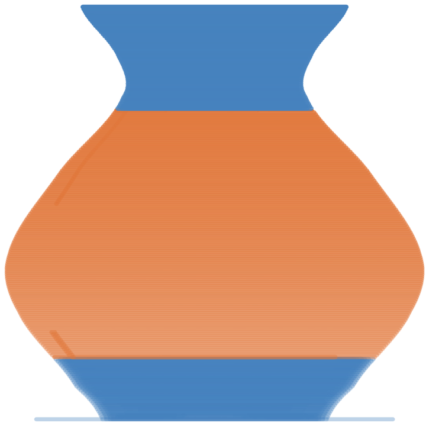
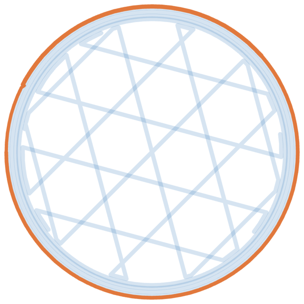
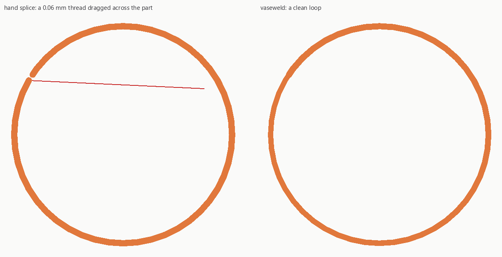
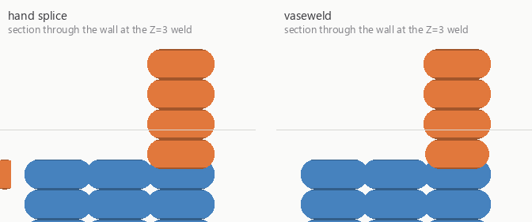

# vaseweld

Spiral vase mode is all-or-nothing in every slicer. vaseweld welds two G-code files sliced from
the same plate at a Z height you pick, so the vase can start above a solid base, or stop below a
solid lid.



*Drawn bead by bead from the welded output below, not a photo and not a mock-up. Blue is the normal
slice, orange is the spiral vase section, and the two seams are at Z=6.2 and Z=30.2. The model is
`examples/vase_40mm.stl`.*

**The output always uses relative extrusion (`M83`).** If your slice uses absolute E (`M82`),
vaseweld converts it. This is not optional: the flow ramp across the transition layer scales
extrusion, and a scaled number is only meaningful as a delta. OrcaSlicer's own `SpiralVase.cpp`
carries the same note, that "Tapering of the transition layer only works reliably with relative
extruder distances". Any post-processing script you run after vaseweld has to expect relative E.

## The problem

Slicers put spiral vase behind a single checkbox that applies to the whole print. People have been
asking for a height range for six years:

- PrusaSlicer [#3204](https://github.com/prusa3d/PrusaSlicer/issues/3204), open since November 2019,
  88 reactions, 42 comments. Latest activity is the bot warning it may be auto-closed as a legacy issue.
- PrusaSlicer [#9340](https://github.com/prusa3d/PrusaSlicer/issues/9340), height range modifiers are
  disabled in vase mode.
- Cura [#7893](https://github.com/Ultimaker/Cura/issues/7893), open since 2020, 27 comments.
- OrcaSlicer [#4625](https://github.com/OrcaSlicer/OrcaSlicer/issues/4625), closed as not planned.
- BambuStudio [#9657](https://github.com/bambulab/BambuStudio/issues/9657), open, someone pointing out
  Simplify3D has done this for years.

The workaround people use is to slice twice and paste the files together in a text editor. That gets
the layer boundary wrong, leaves the extruder in the wrong mode, strands a second start-up sequence
in the middle of the file, and skips the flow transition the slicer would have done. vaseweld does
the same job correctly.

## Install

Pick one. They all produce byte-identical output.

```
pipx run vaseweld weld --help          # no install
uvx vaseweld weld --help               # no install
python -m pip install vaseweld         # console script named vaseweld
```

Or download a single file that needs nothing but Python 3.10+:

```
curl -LO https://raw.githubusercontent.com/Booyaka101/vaseweld/main/vaseweld.py
python vaseweld.py weld --help
```

Or grab `vaseweld.exe` from the [releases page](https://github.com/Booyaka101/vaseweld/releases) if
you would rather not have Python at all.

## Usage

Slice the same plate twice in PrusaSlicer, OrcaSlicer or BambuStudio. Once with Spiral Vase off,
once with it on. Do not move, rescale or reorient the object in between. Save both files, then:

```
$ vaseweld weld --normal base.gcode --vase body.gcode --at 6.2 -o hybrid.gcode
note: removed the printing time estimate, which cannot be recomputed from these two files
cut snapped to Z=6.200 (layer 31)
normal: layers 1-30 (Z 0.200-6.000)
vase: layers 31-200 (Z 6.200-40.000)
E mode: absolute -> relative (converted)
transition ramp: 0.80 -> 1.00 over layer 31
wrote hybrid.gcode (31343 lines)

$ vaseweld check hybrid.gcode
OK: Z monotonic, E coherent (relative), retractions balanced, 1 temperature timeline
```

The note goes to stderr; everything else goes to stdout. That run is reproducible from this
repository. `base.gcode` and `body.gcode` are
`examples/vase_normal_40mm.gcode` and `examples/vase_spiral_40mm.gcode`, two PrusaSlicer 2.9.6
slices of `examples/vase_40mm.stl` at 0.2 mm layers.

`--at` is a height in millimetres, not a layer number. It snaps down to the nearest real layer and
tells you which one:

```
$ vaseweld weld --normal base.gcode --vase body.gcode --at 6.3 -o hybrid.gcode
requested Z=6.300 is between layers, snapping down
cut snapped to Z=6.200 (layer 31)
...
```

Repeat `--at` to alternate again. Two cuts give the shape people actually ask for, a solid base, a
vase body and a solid lid:

```
$ vaseweld weld --normal base.gcode --vase body.gcode --at 6.2 --at 30.2 -o hybrid.gcode
cuts snapped to Z=6.200 (layer 31), Z=30.200 (layer 151)
normal: layers 1-30 (Z 0.200-6.000)
vase: layers 31-150 (Z 6.200-30.000)
normal: layers 151-200 (Z 30.200-40.000)
E mode: absolute -> relative (converted)
transition ramp: 0.80 -> 1.00 over layer 31
transition ramp: 1.00 -> 0.25 over layer 150
wrote hybrid.gcode (45013 lines)
```

Every seam gets its own travel, retraction match and flow ramp, so the spiral ramps up where it
starts and back down where it ends.

If you would rather not guess at the cut height, ask:

```
$ vaseweld layers body.gcode
vase_spiral_40mm.gcode: 200 layers, Z 0.200 to 40.000
layer height: 0.200 mm
weldable range: Z 0.400 to 40.000 (layers 2 to 200)
```

`--vase-first` inverts the order, for a vase body with a solid lid on top:

```
$ vaseweld weld --normal base.gcode --vase body.gcode --at 30.2 --vase-first -o hybrid.gcode
cut snapped to Z=30.200 (layer 151)
vase: layers 1-150 (Z 0.200-30.000)
normal: layers 151-200 (Z 30.200-40.000)
E mode: absolute -> relative (converted)
transition ramp: 1.00 -> 0.25 over layer 150
wrote hybrid.gcode (35289 lines)
```

OrcaSlicer files already use relative E, so nothing is converted, and the flow ratios come from the
file's own config block:

```
$ vaseweld weld --normal orca_base.gcode --vase orca_body.gcode --at 12.4 -o hybrid.gcode
cut snapped to Z=12.400 (layer 62)
normal: layers 1-61 (Z 0.200-12.200)
vase: layers 62-200 (Z 12.400-40.000)
E mode: relative (unchanged)
transition ramp: 0.00 -> 1.00 over layer 62
wrote hybrid.gcode (25647 lines)
```

`0.00` there is OrcaSlicer's shipped default for `spiral_starting_flow_ratio`, which is what Orca
itself would ramp from. If that under-extrudes at the seam, pass `--start-flow 0.8`.

## Running it from the slicer

You can let the slicer call vaseweld on the file it just wrote. Put this in
**Print settings > Output options > Post-processing scripts** on the profile that has Spiral Vase
turned on:

```
"C:\Program Files\vaseweld\vaseweld.exe" weld --normal "C:\prints\base.gcode" --at 12.4
```

The slicer appends the absolute path of a temporary G-code file as the last argument. vaseweld takes
that file as whichever side you left out, here the vase side, and rewrites it in place. It also
reads `SLIC3R_PP_OUTPUT_NAME`, the name the slicer will save under, and prints it so you can see
where the file is going.

Two things to watch. Use absolute paths and quote them, because the field is not a shell. And turn
off **Supports binary G-code** in the same Output options panel, because vaseweld reads text G-code
only and will tell you so rather than guess.

## What it actually does

- Splits both files into header, layers keyed by Z, and footer, using the `;LAYER_CHANGE` and `;Z:`
  markers that PrusaSlicer, OrcaSlicer and BambuStudio all emit, and falling back to bare Z moves.
- Refuses the weld unless both files agree on `layer_height`, `first_layer_height`,
  `nozzle_diameter`, `filament_diameter`, `bed_shape`, `printer_model`, the object instance count,
  and where the object sits on the bed. A mismatch names the field.
- Emits relative E throughout, converting absolute-E segments by differencing consecutive values,
  and resets with `G92 E0` at the seam.
- Ramps the flow across the transition layer the way the slicer would, from
  `spiral_starting_flow_ratio` up to 1.0 across the first vase layer, or from 1.0 down to
  `spiral_finishing_flow_ratio` across the last one. Fallbacks are 0.8 and 0.25 when the key is
  absent, as it is in PrusaSlicer.
- Travels to where the vase slice expects the nozzle, and matches the retraction state that slice
  assumes. A vase layer takes for granted that the nozzle is already on its spiral, because in the
  source file the previous layer ended there. Without the travel the first spiral move drags a line
  across the print. The retraction part matters because slicers disagree about who owns the
  layer-change retraction: PrusaSlicer and OrcaSlicer put it at the start of the next layer,
  BambuStudio at the end of the previous one, so welding them naively leaves the nozzle either
  double-retracted or double-primed.
- Rewrites Klipper's `SET_PRINT_STATS_INFO TOTAL_LAYER` and `CURRENT_LAYER`, the
  `total layers count` comments, and BambuStudio's `HEADER_BLOCK` totals.
- Recomputes the filament totals exactly, and remaps `M73` progress and the printing time estimate
  using the two files' own remaining-time values. When there is no `M73` data to remap from, it
  strips the time comments rather than leave them wrong.
- Passes `G2`/`G3` arc moves through with their geometry untouched. Their E values are still
  converted, because leaving them absolute in a relative file would break the print.
- Writes a `; vaseweld` provenance block into the header naming both inputs and the cut.

## See it without a printer

**[Open the demo](https://booyaka101.github.io/vaseweld/)** and drag the slider. Three welds of the same pair of slices, drawn from
their real G-code, nothing to install.

`vaseweld preview` writes the same thing for your own file, one self-contained HTML file. Open it in any browser and drag the slider:
every bead is drawn at the width the G-code actually asks for, coloured by which slice it came from.

```
$ vaseweld preview hybrid.gcode
wrote hybrid.html (418 KB), open it in any browser
```



That is layer 31 of the two-cut weld, from above. The ghosted blue underneath is the last normal
layer, walls and gyroid infill; the orange loop on top is the first spiral layer. The front view
builds up as you scrub, which is the image at the top of this page.

To rebuild that demo from a fresh clone, with nothing installed:

```
python sim/demo.py
```

That welds the two committed example slices three ways, runs `vaseweld check` on each, and writes
`docs/demo/index.html` linking the three previews.

## Proof it prints

The unit tests prove the output is well formed. `sim/` proves a printer would accept it, by feeding
every case to **Klipper's own host process in batch mode**, which plans each move through the real
cartesian kinematics and the real extruder limits with no printer attached.

```
docker build -t klipper-batch sim/ && python sim/build_cases.py
docker run --rm -v "$PWD/sim:/work" klipper-batch bash /work/run.sh
```

```
PASS  1_absolute_source_normal           print time 368.737s
PASS  1_absolute_source_vase             print time 305.882s
FAIL  2_absolute_naive_text_editor       klippy exit 255, 40 rejected moves
        Move exceeds maximum extrusion (10.116mm^2 vs 0.640mm^2)
PASS  2_relative_naive_text_editor       print time 304.025s
PASS  3_absolute_vaseweld                print time 299.385s
PASS  3_relative_vaseweld                print time 299.512s
PASS  4_absolute_vaseweld_vase_first     print time 371.931s
```

`2_naive_text_editor` is the workaround people use today: paste the two files together at a layer
boundary. With absolute E, which is PrusaSlicer's default, the printer refuses it, because every E
value after the paste is read as an absolute position. With relative E it plans fine but still prints
a 12.5 mm scar, because the nozzle is left where the other file stopped and the spiral starts
somewhere else:

| first move after the cut | travel | filament | flow vs normal |
| --- | --- | --- | --- |
| hand splice, absolute E | 12.522 mm | 33.03150 mm | 7794% |
| hand splice, relative E | 12.522 mm | 0.01694 mm | 4% |
| vaseweld, either | 0.500 mm | 0.01359 mm | 80.2% |

That 80.2% is the transition ramp starting from `--start-flow 0.8`.

`sim/deposit.py` takes it the rest of the way: it turns every extruding move into a bead of known
width and draws the weld layer from above, so you can see what the two files put on the plate.



The red line is a real extrusion, 0.06 mm wide, laid straight across the open middle of the vase.
That is what a hand splice does at the seam, because the nozzle is still where the other file left
it. The same model sawn through the wall:



Bead widths at the weld layer, against a 0.450 mm nominal:

| | hand splice | vaseweld |
| --- | --- | --- |
| the wall | 0.450 mm, no ramp | 0.425 mm, the ramp starting at 80% |
| across the part | 0.059 mm thread | nothing |

`tests/test_weld.py` carries this as a regression guard: no printing move at the weld layer may lay
a bead outside half to twice the layer's own nominal width, checked for all three slicers, with a
companion test that the same measurement does catch a hand splice. See [sim/README.md](sim/README.md).

## The other commands

`vaseweld layers FILE` prints the Z ladder and the weldable range.
`vaseweld preview FILE` writes the HTML page above.
`vaseweld check FILE` works on any G-code file, welded or not. It runs four checks:

| check | what it catches |
| --- | --- |
| Z monotonic | an extruding move below a height already printed, the classic bad splice |
| E coherent | an absolute E value stranded in a relative file, or a mid-print `M82`/`M83` switch |
| retractions balanced | more filament pulled back at once than one retraction's worth, which means an unretract went missing |
| temperature timeline | a blocking `M109`/`M190` in the middle of the print, which is the start-up sequence of a second file |

Exit codes are 0 for OK, 1 for problems found, 2 for a file it could not read.

```
$ vaseweld check broken.gcode
FAIL: 1 problem in broken.gcode
  line 12695: blocking temperature wait (M109 S215) in the middle of the print; this is the start-up sequence of a second file
```

## Options

`vaseweld weld` takes:

```
--normal PATH          the non-vase slice
--vase PATH            the spiral vase slice
--at Z                 cut height in mm, snapped down to a real layer; repeat to alternate again
-o, --output PATH      file to write
--vase-first           start with the vase part below the first cut
--start-flow RATIO     override spiral_starting_flow_ratio (0 to 1)
--finish-flow RATIO    override spiral_finishing_flow_ratio (0 to 1)
--no-seam-retract      do not retract before the seam travel
--dry-run              report the plan and write nothing
--force                weld despite a profile mismatch, and say what was ignored
                       and what that does to the seam
```

## Limitations

These are out of scope for 1.0, not bugs:

- Text G-code only. Binary `.bgcode` is refused with the setting to change.
- Single object, single material. This is the same constraint PrusaSlicer's own validator enforces,
  and vaseweld quotes it back at you: "The Spiral Vase option can only be used when printing single
  material objects."
- vaseweld does not slice. You bring both files.
- The printing time estimate can only be recomputed when the files carry `M73` remaining times,
  which PrusaSlicer emits only with "Supports remaining times" enabled. Otherwise the estimate is
  stripped.
- Adaptive or variable layer height will make the two files disagree on layer Z. Slice both with a
  fixed layer height.

## Development

```
git clone https://github.com/Booyaka101/vaseweld
cd vaseweld
python -m pytest
```

138 tests, about 40 seconds, no dependencies beyond pytest. Everything runs against real slicer
output committed under `tests/fixtures/`, produced by driving PrusaSlicer 2.9.6, OrcaSlicer 2.4.2
and BambuStudio 02.08.02.61 from the command line over the models in `examples/`. See
[tests/fixtures/README.md](tests/fixtures/README.md) for the exact commands.

`vaseweld.py` at the repository root is generated from `src/vaseweld/` by
`python tools/build_single_file.py`. A test fails if it drifts.

## License

MIT.
